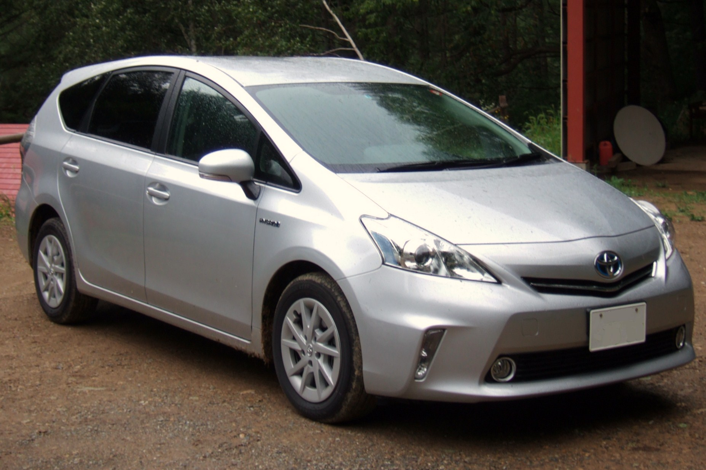

<table>
<tr>
  <td><a href = "http://1625050744.github.io/BGroup/index.html">トップ</a> </td>
  <td><a href = ".html">YORICA利用方法</a> </td>
  <td><a href = "https://16-2505-020-7.github.io/YORICA/TimeTable.html">YORICA利用可能エリア</a> </td>
  <td><a href = "https://kodai1221.github.io/employment/index.html">運転手雇用について</a> </td>
  <td><a href = "https://16-2505-0468.github.io/w046ff/dandai.html">実績紹介</a> </td> 
</tr>
<tr>
  <td><a href = "hoby.html">問合わせ</a> </td>
</tr>
</table> 

# 雇用情報

# ◎職種と仕事内容

## 運転スタッフ

## 指定区域内での乗務業

- YORICA提携の商店街と連携店区間の運転です！

- 商店街などをご利用するお客様を乗せて運転します。

- 運転する車は中型なので、心配いりません！

  

# ◎求めている人材

## 【タクシー運転の経験者でも、そうでない方でも、運転技術を活かして活躍できます！】

-　※普通2種免許をお持ちの方優遇

## 【具体的には】

- 安全で楽しく運転できる方を求めています！！

- 普通１種免許（取得後３年以上、AT限定可）または普通２種免許をお持ちの方）

- 年齢・経験不問・・・定年６４歳

## 【以下の方に向いています！！】

- お客様と楽しくコミュニケーションをとりたい方

- 街の活性化に協力したい方

# ◎勤務時間

-　９：００～１８：３０

- 上記の営業時間内で**週15時間**勤務（シフト制）

# ★少しでも興味ある方は気軽にご連絡ください！！

## 採用連絡先
- TEL: 〇〇〇〇-〇〇〇-〇〇〇
- Email: xxxx@yirika.com

